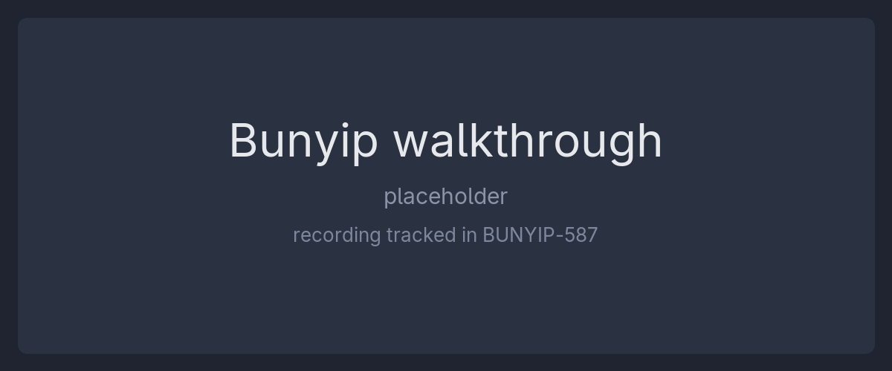

# Bunyip

**The PSA Systems SaaS platform** - signup, subscription billing, platform admin, and an OpenID Connect provider for the Mokosh PSA product.

_Surfaces what matters._

<!--
BUNYIP-587 records the one-minute walkthrough GIF and drops it at docs/assets/bunyip-walkthrough.gif.
When it lands, replace this comment with:

-->

## Try it

Live staging: **<https://a8n.systems>**. Sign up with a throwaway email and click through the product.

> Staging shows features **in development**, not a polished demo. State is **wiped on every deploy** - accounts, organizations, and data are throwaway. Do not reuse a real password.

## What it is

Two Rust services in one Cargo workspace:

- **bunyip-web** (port 4400) - the browser-facing front-end. Axum server-rendered HTML (Maud + htmx), no SPA. It is a BFF: it talks to bunyip-api over `/v1` and renders the pages.
- **bunyip-api** (port 4401) - the backend and the OIDC / OAuth 2.1 issuer (`/.well-known/*`, `/oauth2/*`). Real PostgreSQL persistence, at-rest encryption, Stripe billing, email.

Domain code lives in `crates/bunyip-{domain,oci,oidc}`; the generic, domain-free kernel is the `dunite-core` git dependency. Dependency direction is strictly downward: `bunyip-api -> bunyip-oci/oidc -> bunyip-domain -> dunite-core`.

## Run it locally

Requires Docker or Podman with Compose.

```nu
just dev
```

Then:

- Front-end: <http://localhost:4400>
- API health: <http://localhost:4401/health>
- OIDC discovery: <http://localhost:4401/.well-known/openid-configuration>

Full dev setup, including SSO against Mokosh, is in [docs/getting-started.md](docs/getting-started.md).

## Self-host

`compose.yml` is the reference deployment: the published `bunyip-api` and `bunyip-web` images plus PostgreSQL, behind a Traefik edge that terminates TLS. The two images are released as a matched pair and pinned together (`BUNYIP_API_IMAGE` / `BUNYIP_WEB_IMAGE`); startup secrets are files provided through the `{NAME}_FILE` convention, never plain environment variables.

The full self-host guide - topology, deploy, update checking, and applying updates - is in **[docs/self-hosting.md](docs/self-hosting.md)**.

- Every configuration variable and where its value comes from: [docs/configuration.md](docs/configuration.md)
- Secrets, the two-tier model, and Infisical: [docs/secrets-infisical.md](docs/secrets-infisical.md)

## Documentation

Operator and developer docs live in [`docs/`](docs/):

- [getting-started.md](docs/getting-started.md) - local dev stack and sign-in
- [configuration.md](docs/configuration.md) - the full environment-variable and in-app-settings reference
- [self-hosting.md](docs/self-hosting.md) - deploy, update, and run the released images
- [secrets-infisical.md](docs/secrets-infisical.md) - secret sourcing and rotation

Contributor-facing conventions for AI agents working in this repository are in [CLAUDE.md](CLAUDE.md).

## Contributing

- Work happens in `feat/` / `fix/` / `chore/<short-descriptive-name>` branches off `main`; the merge target is `main` via PR.
- Clone with `git clone --recurse-submodules`, or run `git submodule update --init` in an existing clone: the root `justfile` imports the shared recipes from the `common` submodule ([psa-systems/common](https://dev.a8n.run/psa-systems/common)), and without it every `just` command is a parse error.
- `just check` runs fmt + clippy + build + the docker builder stage; dev boxes without a local Rust toolchain use `just check-container`.
- `just install-hooks` writes the git pre-commit hook; the hook and `just pre-commit` come from `common` and run the same fmt + clippy + build + test sequence CI does, inside the `compose.dev.yml` `api` service.
- Dev container names follow `dev-bunyip-<service>-${USER}` on network `dev-bunyip-private-${USER}`; the production stack (`compose.yml`) drops the `dev-` prefix.
- Releases: `just create-release <major|minor|hotfix>` bumps the workspace version and opens a release PR; merging it tags `vX.Y.Z` and publishes the images. Both halves come from `common` - the recipe from `common/common.just`, and [`.forgejo/workflows/create-release.yml`](.forgejo/workflows/create-release.yml) as a caller stub for the reusable workflow that tags and writes the release notes. The recipe's `Cargo.lock` sync runs host-side `cargo`, so cut releases from a box with a Rust toolchain.
- CI reads a fixed set of repository-level Forgejo Actions secrets and variables; the authoritative list is in [`e2e/README.md`](e2e/README.md#forgejo-actions-secrets-and-variables), and values are never recorded in the repo.

## Development happens on Forgejo

The development home for this repository is <https://dev.a8n.run/psa-systems/bunyip>. The [GitHub](https://github.com/psa-systems/bunyip) and [Codeberg](https://codeberg.org/psa-systems/bunyip) copies are read-only mirrors that exist for visibility only: issues and pull requests are disabled there, and no community support runs on the mirrors. File issues and open pull requests on Forgejo.

## Security

Please do not report a suspected vulnerability through the public issue tracker, on Forgejo or on either mirror: filing it there publishes it. Contact a maintainer privately instead. A published disclosure address and a `SECURITY.md` are being set up and this section will link to them.

## License

MIT. See [LICENSE](LICENSE).

## Authors and credits

Bunyip is built by PSA Systems, and the Bunyip artwork is original to the project.

Built on [Rust](https://www.rust-lang.org/), [Actix Web](https://actix.rs/), [Maud](https://maud.lambda.xyz/), [Tailwind CSS](https://tailwindcss.com/) and [PostgreSQL](https://www.postgresql.org/), and deployed behind [Traefik](https://traefik.io/). Secrets are sourced through [Infisical](https://infisical.com/).
